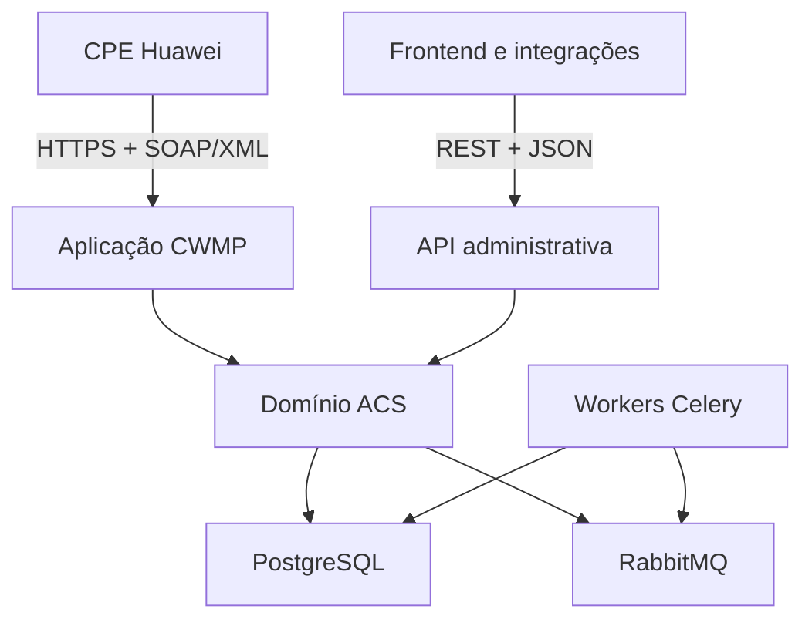
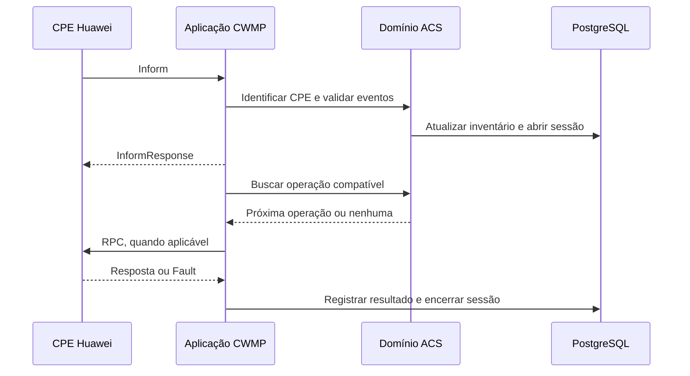
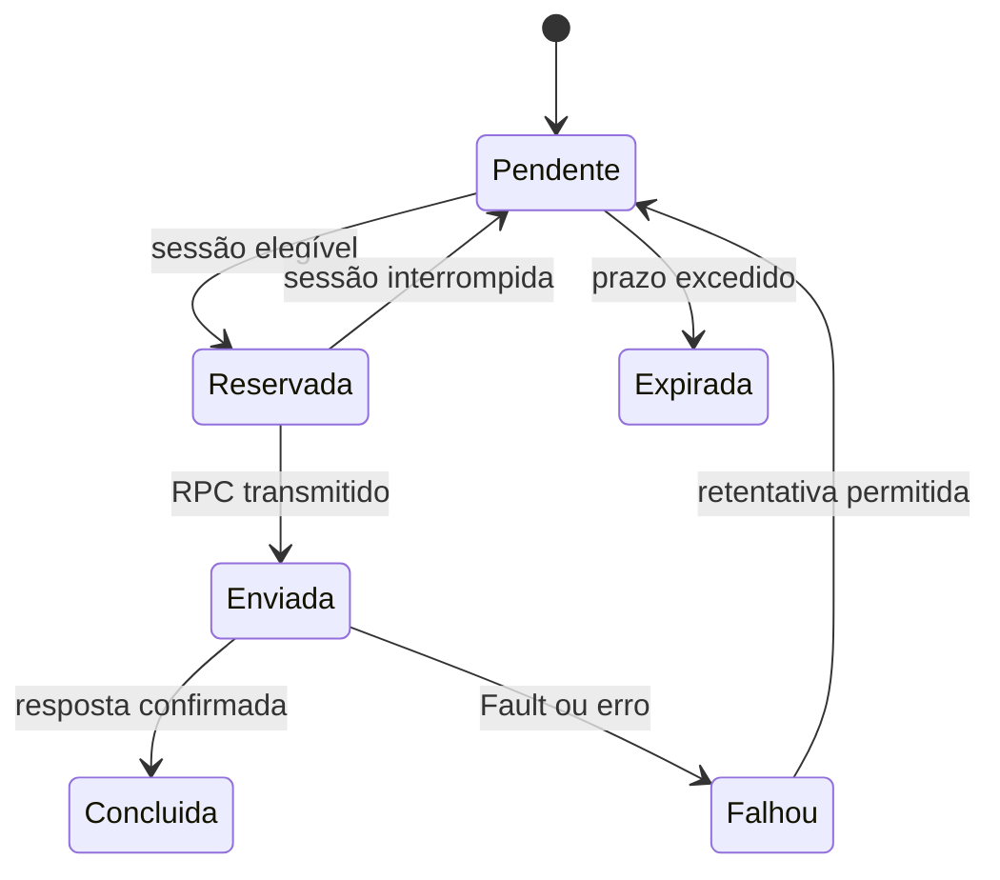

# Modelagem do Backend ACS

## 1. Identificação

| Campo | Valor |
| --- | --- |
| Projeto | ACS para gerenciamento de CPEs Huawei |
| Documento | Modelagem técnica do backend e estratégia de implementação |
| Versão | 0.1 |
| Estado | Em elaboração |
| Linguagem principal | Python 3.13 |
| Framework | FastAPI |
| Protocolo de gerenciamento | TR-069/CWMP |
| Gerenciamento de projeto | uv |
| Estratégia de desenvolvimento | Backend-first, com entregas verticais e incrementais |
| Referência arquitetural principal | FreeACS, sem fork e sem tradução direta do código Java |

## 2. Objetivo

Este documento define a orientação inicial para o desenvolvimento do backend do ACS. O backend deverá receber e controlar sessões TR-069 de CPEs Huawei, persistir inventário e eventos, coordenar operações remotas e expor uma API REST para o futuro frontend e para integrações internas.

O projeto FreeACS será estudado como referência de arquitetura, comportamento e problemas já enfrentados em ambientes reais. O novo sistema, porém, será uma implementação própria em Python, adequada aos requisitos da empresa e sem dependência de um fork do código Java.

Este documento complementa:

- `documentacao_requisitos_funcionais_acs.md`;
- `modelagem_projeto.md`.

## 3. Decisão arquitetural

O desenvolvimento começará pelo backend. O núcleo TR-069 será encapsulado por serviços de domínio e será acompanhado por uma API REST administrativa. O frontend somente deverá avançar sobre funcionalidades cujos contratos e comportamentos principais já estejam validados.

Essa ordem permite:

- validar primeiro a comunicação real com as CPEs Huawei;
- estabilizar o modelo de dados e os contratos OpenAPI;
- testar operações TR-069 sem dependência da interface gráfica;
- reduzir retrabalho no frontend;
- criar um simulador e testes automatizados antes da exposição operacional;
- evoluir em pequenas entregas demonstráveis.

## 4. Papel das fontes de referência

| Fonte | Papel no projeto | Não deve ser usada para |
| --- | --- | --- |
| Especificações Broadband Forum | Fonte normativa do protocolo e dos modelos de dados | Ser substituída pelo comportamento de outro ACS |
| FreeACS | Referência de arquitetura, fluxos, compatibilidade e experiência operacional | Tradução linha a linha, cópia de estrutura Java ou adoção automática do banco legado |
| GenieACS | Referência comparativa e possível oráculo de testes de caixa-preta em laboratório | Definir sozinho os requisitos do produto ou justificar cópia de código |
| CPEs Huawei homologadas | Validação final do comportamento e da compatibilidade | Generalização para todos os modelos e firmwares sem uma matriz de testes |
| Requisitos internos | Definição do valor de negócio, permissões, auditoria e experiência operacional | Alteração informal sem critérios de aceite e rastreabilidade |

### 4.1 Princípio de precedência

Quando houver divergência entre uma implementação de referência e a especificação:

1. registrar o caso observado;
2. confirmar a versão aplicável da especificação Broadband Forum;
3. verificar se existe particularidade do modelo ou firmware Huawei;
4. implementar a compatibilidade em um adaptador isolado;
5. adicionar fixture e teste de regressão;
6. registrar a decisão e a evidência na matriz de compatibilidade.

## 5. Uso responsável do FreeACS

### 5.1 Informações que deverão ser estudadas

O estudo do FreeACS deverá concentrar-se em conceitos e comportamentos transferíveis para a implementação Python:

- ciclo de vida de uma sessão CWMP;
- autenticação e identificação das CPEs;
- processamento de `Inform` e eventos;
- correlação entre requisições e respostas SOAP;
- despacho e tratamento de RPCs;
- filas de tarefas e operações pendentes;
- provisionamento baseado em regras;
- representação de parâmetros e modelos de dados;
- controle de firmware e arquivos;
- retentativas, timeouts, faults e idempotência;
- registro de eventos, auditoria e observabilidade;
- compatibilidade específica por fabricante, modelo e firmware;
- separação entre funções administrativas e comunicação com dispositivos.

### 5.2 Elementos que não deverão ser transportados automaticamente

- hierarquia de classes Java;
- servlets ou decisões vinculadas ao servidor de aplicação utilizado;
- esquema de banco de dados sem remodelagem para os requisitos atuais;
- acoplamentos entre interface, provisionamento e protocolo;
- padrões de segurança antigos;
- configurações e credenciais de exemplo;
- dependências descontinuadas;
- comportamentos que não possam ser relacionados à especificação ou reproduzidos em testes.

### 5.3 Registro do estudo

Cada comportamento relevante deverá ser registrado em uma matriz:

| Campo | Descrição |
| --- | --- |
| Identificador | Código único do item estudado |
| Tema | Sessão, RPC, autenticação, arquivo, provisionamento ou outro |
| Comportamento no FreeACS | Resumo do comportamento observado |
| Referência normativa | Seção ou documento Broadband Forum relacionado |
| Aplicação no projeto | Adotar, adaptar, rejeitar ou investigar |
| Justificativa | Motivo técnico e de negócio |
| Modelo/firmware Huawei | Escopo de compatibilidade conhecido |
| Evidência de teste | Fixture, teste automatizado ou resultado de laboratório |

Um histórico público do FreeACS registra, por exemplo, uma adaptação relacionada a equipamentos Huawei em que um valor booleano de `NextLevel` precisou ser representado como `0`. Esse tipo de ocorrência é útil como alerta de interoperabilidade, mas deverá ser confirmado com os equipamentos e firmwares da empresa antes de se transformar em regra do novo ACS.

## 6. Arquitetura proposta

Será adotado inicialmente um monólito modular, implantado em processos separados conforme o tipo de carga.



### 6.1 Aplicação CWMP

Ponto de entrada sugerido: `POST /cwmp`.

Responsabilidades:

- aceitar conexões HTTPS das CPEs;
- autenticar o equipamento conforme a política definida;
- limitar tamanho do corpo e tempo da sessão;
- interpretar envelopes SOAP/XML com segurança;
- processar `Inform` e devolver `InformResponse`;
- manter o estado da sessão CWMP;
- selecionar uma operação pendente compatível;
- enviar RPCs ao equipamento;
- processar respostas e `Fault`;
- receber eventos como `TransferComplete`;
- atualizar inventário, parâmetros relevantes e última comunicação;
- produzir logs técnicos estruturados e métricas.

### 6.2 API administrativa

Prefixo sugerido: `/api/v1`.

Responsabilidades:

- expor inventário, detalhes e históricos das CPEs;
- receber solicitações de operações remotas;
- consultar o estado e o resultado das operações;
- gerenciar usuários, papéis e permissões;
- gerenciar arquivos, firmwares e perfis;
- fornecer endpoints para integrações internas;
- publicar um contrato OpenAPI versionado;
- aplicar autenticação, autorização e auditoria.

A API REST não deverá simular uma operação síncrona quando sua conclusão depender de uma futura sessão da CPE. Nesses casos, deverá criar um recurso de operação, retornar seu identificador e permitir o acompanhamento de estado.

### 6.3 Domínio ACS

O domínio deverá permanecer independente de HTTP, SOAP, FastAPI, Celery e detalhes do banco. Ele concentrará:

- identidade e ciclo de vida da CPE;
- sessão CWMP;
- operação remota;
- regras de elegibilidade e compatibilidade;
- transições de estado;
- provisionamento;
- eventos e auditoria;
- estado atual e estado desejado.

### 6.4 Workers

Responsabilidades:

- executar tarefas assíncronas e agendadas;
- aplicar retentativas autorizadas;
- expirar operações;
- calcular indicadores;
- processar exportações;
- validar arquivos e firmwares;
- realizar rotinas de retenção;
- emitir notificações internas.

O worker não deverá considerar uma tarefa da fila como uma execução concluída na CPE. A conclusão somente ocorre após resposta CWMP válida ou evento de confirmação aplicável.

## 7. Stack do backend

| Área | Tecnologia inicial | Finalidade |
| --- | --- | --- |
| Linguagem | Python 3.13 | Implementação do backend |
| Projeto e dependências | uv | Ambiente virtual, resolução, instalação e lockfile |
| HTTP e REST | FastAPI/Starlette | API administrativa e base HTTP do endpoint CWMP |
| Contratos | Pydantic | Validação de entradas, saídas e configurações |
| Persistência | SQLAlchemy | Mapeamento e acesso ao banco |
| Migrações | Alembic | Evolução controlada do esquema |
| Banco principal | PostgreSQL | Fonte de verdade transacional |
| Broker | RabbitMQ | Entrega durável de tarefas |
| Processamento assíncrono | Celery | Workers e agendamentos |
| Cache e locks | Redis | Estado efêmero, cache e coordenação |
| Objetos | MinIO/S3 | Firmwares, configurações e exportações |
| Testes | Pytest | Testes unitários, integração e protocolo |
| Qualidade | Ruff e Pyright | Formatação, lint e análise estática |

As bibliotecas específicas para SOAP/XML deverão ser escolhidas por uma prova técnica que avalie segurança contra XXE, controle sobre namespaces, desempenho, manutenção e licença. O protocolo CWMP não deverá ser modelado como uma API JSON convencional.

### 7.1 Gerenciamento do projeto Python

O backend utilizará o `uv` para gerenciar a versão do Python, o ambiente virtual e as dependências do projeto.

- o ambiente virtual local será criado em `backend/.venv`;
- as dependências diretas serão declaradas em `backend/pyproject.toml`;
- o arquivo `backend/uv.lock` deverá ser versionado;
- a versão do Python será fixada em `backend/.python-version`;
- `uv sync` será o comando padrão para criar ou sincronizar o ambiente;
- `uv add <pacote>` e `uv add --dev <pacote>` serão usados para adicionar dependências;
- comandos do projeto serão executados com `uv run`, sem exigir ativação manual do ambiente;
- instalações diretas com `pip` não deverão fazer parte do fluxo normal de desenvolvimento ou do pipeline.

Comandos iniciais:

```bash
cd backend
uv sync
uv run pytest
uv run ruff check .
uv run pyright
```

## 8. Organização interna sugerida

```text
backend/
├── AGENTS.md
├── .python-version
├── pyproject.toml
├── uv.lock
├── migrations/
├── src/
│   └── acs/
│       ├── api/
│       │   ├── routes/
│       │   ├── schemas/
│       │   └── dependencies/
│       ├── cwmp/
│       │   ├── http/
│       │   ├── soap/
│       │   ├── rpc/
│       │   ├── session/
│       │   └── compatibility/
│       ├── domain/
│       │   ├── cpe/
│       │   ├── operations/
│       │   ├── provisioning/
│       │   └── events/
│       ├── application/
│       │   ├── commands/
│       │   ├── queries/
│       │   └── services/
│       ├── infrastructure/
│       │   ├── database/
│       │   ├── messaging/
│       │   ├── storage/
│       │   └── observability/
│       ├── workers/
│       └── settings.py
└── tests/
    ├── unit/
    ├── integration/
    ├── contract/
    ├── fixtures/
    │   └── cwmp/
    └── simulator/
```

## 9. Modelo conceitual inicial

| Entidade | Responsabilidade |
| --- | --- |
| `Cpe` | Identidade, fabricante, modelo, serial, firmware, hardware e última comunicação |
| `CwmpSession` | Estado e correlação de uma sessão iniciada pela CPE |
| `CwmpEvent` | Eventos recebidos no `Inform`, como bootstrap, periodic e connection request |
| `ParameterSnapshot` | Conjunto de parâmetros observado em determinado momento |
| `DesiredParameter` | Valor desejado que ainda poderá precisar ser aplicado |
| `RemoteOperation` | Pedido rastreável de consulta, alteração, reboot, diagnóstico ou transferência |
| `OperationAttempt` | Tentativa individual de executar uma operação durante uma sessão |
| `RpcExchange` | Metadados da requisição, resposta ou fault CWMP |
| `DeviceProfile` | Regras e configurações destinadas a um conjunto de CPEs |
| `CompatibilityProfile` | Capacidades e adaptações por fabricante, modelo e firmware |
| `ManagedFile` | Firmware ou configuração, com versão, checksum e compatibilidade |
| `AuditEvent` | Registro de ação humana, automática ou originada pela CPE |

### 9.1 Estado atual, desejado e operação

O sistema deverá distinguir:

- **estado atual:** último valor confirmado pela CPE;
- **estado desejado:** valor que a plataforma pretende aplicar;
- **operação:** unidade rastreável criada para consultar ou modificar a CPE;
- **tentativa:** execução da operação em uma sessão CWMP específica.

Essa separação evita apresentar como concluída uma configuração que ainda está pendente ou que falhou.

## 10. Ciclo de uma sessão CWMP



Aspectos que deverão ser explícitos na implementação:

- identificação por `Manufacturer`, `OUI`, `ProductClass` e `SerialNumber`;
- suporte às versões CWMP aprovadas no escopo;
- correlação por `cwmp:ID`;
- tratamento de sessão sem operação pendente;
- ordem e elegibilidade das operações;
- prevenção de execução duplicada;
- persistência antes do envio de uma operação crítica;
- tratamento de desconexão no meio da sessão;
- normalização de faults sem perda do código e da mensagem originais.

## 11. RPCs e evolução de capacidades

### 11.1 Núcleo inicial

| RPC ou evento | Objetivo | Entrega sugerida |
| --- | --- | --- |
| `Inform` / `InformResponse` | Registrar e reconhecer a CPE | Primeira entrega vertical |
| `GetParameterValues` | Consultar parâmetros conhecidos | Após estabilização do `Inform` |
| `GetParameterNames` | Descobrir parâmetros e objetos | Após consultas básicas |
| `SetParameterValues` | Alterar parâmetros autorizados | Após modelo de operações e auditoria |
| `Reboot` | Reiniciar a CPE de forma rastreável | Após permissões e confirmações |
| `TransferComplete` | Confirmar transferências | Etapa de arquivos e firmware |
| `Download` | Solicitar firmware ou configuração | Etapa posterior e controlada |
| `Fault` | Registrar falhas de protocolo ou parâmetros | Desde o primeiro RPC executável |

Outros RPCs deverão ser adicionados somente com requisito, caso de uso e evidência de compatibilidade.

## 12. Ciclo de vida de operações remotas



Cada operação deverá registrar:

- identificador único;
- CPE de destino;
- autor humano ou sistema de origem;
- tipo e parâmetros solicitados;
- estado e versão para controle de concorrência;
- data de criação e expiração;
- quantidade de tentativas;
- sessão e tentativa relacionadas;
- resposta ou fault;
- política de retentativa;
- datas de início e conclusão;
- trilha de auditoria.

## 13. Compatibilidade Huawei

A compatibilidade não deverá ser implementada por condicionais espalhadas pelo sistema. Deverá existir uma camada de adaptadores ou perfis selecionados por fabricante, OUI, produto, modelo e versão de firmware.

Cada perfil poderá declarar:

- versão CWMP suportada;
- raiz do modelo de dados, como `InternetGatewayDevice` ou `Device`;
- caminhos de parâmetros equivalentes;
- RPCs suportados;
- formatos ou valores peculiares;
- limites de sessão;
- comportamento de Connection Request;
- procedimentos de atualização de firmware;
- fixtures e testes obrigatórios.

Os modelos Huawei já observados deverão iniciar a matriz de homologação, sem assumir equivalência entre eles:

- EG8145V5-V2;
- EG8145X6-10;
- EG8145V5;
- EG8245W5-6T;
- EG8245H;
- HG8121H;
- V166a-20.

## 14. Persistência

PostgreSQL será a fonte de verdade. A estratégia para parâmetros será híbrida:

- colunas relacionais para identidade, status e campos pesquisados frequentemente;
- JSONB para snapshots extensos ou parâmetros específicos de fabricante;
- histórico normalizado apenas para parâmetros com valor operacional ou analítico;
- payloads SOAP brutos somente quando necessários, protegidos e sujeitos a retenção;
- índices definidos a partir das consultas reais da API.

Não se deverá armazenar cada parâmetro recebido indefinidamente sem uma política de valor, custo e retenção.

## 15. API REST inicial

Endpoints indicativos da primeira fase:

| Método | Caminho | Finalidade |
| --- | --- | --- |
| `GET` | `/api/v1/health` | Verificar a saúde básica da aplicação |
| `GET` | `/api/v1/cpes` | Listar e filtrar CPEs conhecidas |
| `GET` | `/api/v1/cpes/{cpe_id}` | Consultar o resumo de uma CPE |
| `GET` | `/api/v1/cpes/{cpe_id}/events` | Consultar eventos recebidos |
| `GET` | `/api/v1/cpes/{cpe_id}/sessions` | Consultar sessões CWMP |
| `POST` | `/api/v1/cpes/{cpe_id}/operations` | Criar uma operação remota autorizada |
| `GET` | `/api/v1/operations/{operation_id}` | Acompanhar uma operação |

Regras iniciais:

- paginação, filtros e ordenação deverão ocorrer no backend;
- datas deverão ser retornadas com fuso explícito;
- erros terão formato consistente e identificador de correlação;
- endpoints serão versionados;
- o OpenAPI será validado no pipeline;
- operações destrutivas não poderão ser representadas como simples consultas;
- autorização e auditoria deverão ser aplicadas no caso de uso, não somente na rota.

## 16. Segurança

### 16.1 Endpoint CWMP

- TLS obrigatório nos ambientes de homologação e produção;
- autenticação de CPE definida e testada;
- parser XML protegido contra XXE e expansão maliciosa;
- limites de corpo, profundidade, duração e concorrência;
- validação de namespaces e tipos esperados;
- rate limiting e proteção contra abuso;
- mascaramento de senhas, tokens e dados sensíveis;
- segregação de rede em relação à API administrativa;
- correlação de logs sem depender de conteúdo sensível;
- política explícita para Connection Request.

### 16.2 API administrativa

- autenticação integrada à solução de identidade aprovada;
- RBAC com permissões específicas por ação;
- confirmação reforçada para firmware, reboot em lote e factory reset;
- trilha de auditoria imutável para operações críticas;
- proteção contra enumeração e acesso indevido a CPEs;
- validação dos arquivos antes de disponibilizá-los;
- segredos fora do código e dos arquivos versionados.

## 17. Observabilidade

O backend deverá disponibilizar:

- logs estruturados com identificadores de CPE, sessão e operação;
- métricas de sessões iniciadas, concluídas, interrompidas e rejeitadas;
- duração das sessões e RPCs;
- contagem de faults por código, modelo e firmware;
- tamanho e latência das filas;
- quantidade de operações pendentes, concluídas, falhas e expiradas;
- taxa de sucesso por RPC e perfil de compatibilidade;
- health checks separados para API, CWMP, banco, broker e cache;
- rastreamento distribuído quando o ganho operacional justificar sua adoção.

Credenciais e valores sensíveis nunca deverão aparecer em logs, métricas ou traces.

## 18. Estratégia de testes

### 18.1 Pirâmide de testes

- testes unitários do domínio e da máquina de estados;
- testes de parser e serializer com fixtures SOAP/XML;
- testes de contrato da API REST e do OpenAPI;
- testes de integração com PostgreSQL, RabbitMQ e Redis;
- simulador de CPE para sessões determinísticas;
- testes de regressão por modelo e firmware Huawei;
- testes de interoperabilidade em laboratório com CPEs reais;
- testes de carga separados para `/cwmp` e `/api/v1`;
- testes de segurança do parser XML, autenticação e permissões.

### 18.2 Fixtures obrigatórias

As fixtures deverão preservar mensagens representativas e anonimizadas para:

- `Inform` inicial;
- `Inform` periódico;
- resposta de `GetParameterValues`;
- resposta de `GetParameterNames`;
- resposta de `SetParameterValues`;
- resposta de `Reboot`;
- `TransferComplete`;
- faults conhecidos;
- desconexão ou mensagem incompleta;
- variações reais dos modelos Huawei homologados.

### 18.3 Oráculos de teste

O comportamento de FreeACS ou GenieACS poderá ser observado em laboratório para comparação. O resultado será evidência auxiliar, e não prova normativa. Diferenças deverão ser verificadas contra a especificação e contra a CPE real.

## 19. Roadmap por pequenas entregas

### Entrega 0 — Estudo controlado e ambiente

Objetivos:

- criar a matriz de estudo FreeACS/especificação/requisito;
- definir versões CWMP e modelos de dados inicialmente suportados;
- identificar modelos e firmwares Huawei disponíveis em laboratório;
- preparar PostgreSQL, ferramentas de qualidade e pipeline;
- criar simulador mínimo de CPE.

Critério de saída: ambiente reproduzível e primeiro conjunto de fixtures versionado.

### Entrega 1 — Primeiro fluxo vertical

Objetivos:

- expor `/cwmp`;
- receber e validar `Inform`;
- identificar ou cadastrar a CPE;
- persistir eventos e última comunicação;
- responder `InformResponse`;
- expor a CPE em `GET /api/v1/cpes` e `GET /api/v1/cpes/{id}`.

Critério de aceite: uma CPE Huawei homologada conecta-se e autentica-se, envia `Inform`, recebe resposta válida e aparece na API REST com identidade, eventos e horário da última comunicação.

### Entrega 2 — Sessão e inventário confiáveis

Objetivos:

- persistir sessões e faults;
- tratar mensagens vazias e encerramento;
- implementar paginação e filtros básicos;
- adicionar métricas e logs correlacionados;
- ampliar testes por modelo e firmware.

### Entrega 3 — Consultas remotas

Objetivos:

- implementar `GetParameterValues`;
- implementar `GetParameterNames` quando necessário;
- modelar operação, tentativa e expiração;
- disponibilizar acompanhamento pela API REST.

### Entrega 4 — Alterações controladas

Objetivos:

- implementar `SetParameterValues`;
- implementar `Reboot`;
- aplicar autorização e auditoria;
- adicionar idempotência, retentativas e confirmação reforçada.

### Entrega 5 — Compatibilidade e provisionamento

Objetivos:

- formalizar perfis Huawei;
- implementar estado desejado;
- criar regras de provisionamento limitadas e testáveis;
- ampliar a matriz de homologação.

### Entrega 6 — Arquivos, firmware e diagnósticos

Objetivos:

- implementar armazenamento e validação de arquivos;
- adicionar `Download` e `TransferComplete`;
- implementar os diagnósticos priorizados nos requisitos;
- estabelecer controles adicionais para operações de alto impacto.

### Entrega 7 — Integração com o frontend

Objetivos:

- estabilizar e versionar os primeiros contratos OpenAPI;
- gerar o cliente TypeScript;
- construir o inventário e o detalhe da CPE sobre endpoints validados;
- criar testes ponta a ponta dos fluxos administrativos.

O frontend poderá iniciar protótipos e componentes visuais antes dessa etapa, mas não deverá cristalizar contratos ainda instáveis.

## 20. Critérios gerais de conclusão

Uma entrega do backend somente será considerada concluída quando:

1. possuir critérios de aceite automatizados sempre que tecnicamente possível;
2. incluir testes unitários e de integração adequados ao risco;
3. manter `Ruff`, `Pyright` e `Pytest` aprovados;
4. incluir migration quando houver alteração de banco;
5. atualizar o OpenAPI quando houver alteração da API;
6. não expor segredos ou dados sensíveis;
7. registrar logs e métricas operacionais suficientes;
8. documentar incompatibilidades conhecidas;
9. ser validada no simulador e, quando aplicável, em CPE Huawei de laboratório;
10. preservar rastreabilidade entre requisito, implementação e teste.

## 21. Decisões pendentes

- biblioteca segura de XML/SOAP;
- versões CWMP e modelos de dados do primeiro MVP;
- política de autenticação das CPEs;
- uso e segurança de Connection Request;
- solução de identidade da API administrativa;
- estratégia de idempotência e locking por CPE;
- retenção de payloads, sessões, parâmetros e auditoria;
- volume esperado de sessões simultâneas e `Inform` por minuto;
- objetivos de disponibilidade, recuperação e latência;
- modelos e firmwares Huawei prioritários para homologação;
- política para operações em lote e de alto impacto.

## 22. Próxima atividade recomendada

Produzir a especificação da Entrega 1 contendo:

- contrato HTTP/SOAP do `Inform` e `InformResponse`;
- máquina de estados mínima da sessão;
- esquema inicial das entidades `Cpe`, `CwmpSession` e `CwmpEvent`;
- endpoints REST e schemas Pydantic;
- fixtures anonimizadas de uma CPE Huawei real e de um simulador;
- critérios de aceite e casos de erro;
- ameaças e controles de segurança do endpoint `/cwmp`.

## 23. Referências

- [FreeACS — repositório oficial](https://github.com/freeacs/freeacs)
- [FreeACS — histórico do módulo TR-069](https://github.com/freeacs/freeacs/blob/master/tr069/version.txt)
- [GenieACS — repositório oficial](https://github.com/genieacs/genieacs)
- [GenieACS — documentação](https://docs.genieacs.com/)
- [Broadband Forum — TR-069/CWMP](https://www.broadband-forum.org/technical/download/TR-069.pdf)
- [Broadband Forum — modelos de dados CWMP](https://cwmp-data-models.broadband-forum.org/)

## 24. Controle de versões

| Versão | Alteração |
| --- | --- |
| 0.1 | Criação da modelagem backend-first, uso do FreeACS como referência e definição do roadmap técnico inicial |
