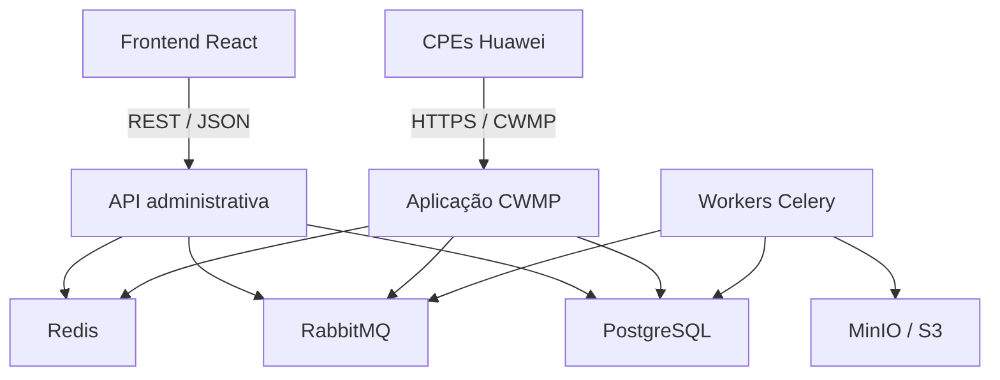
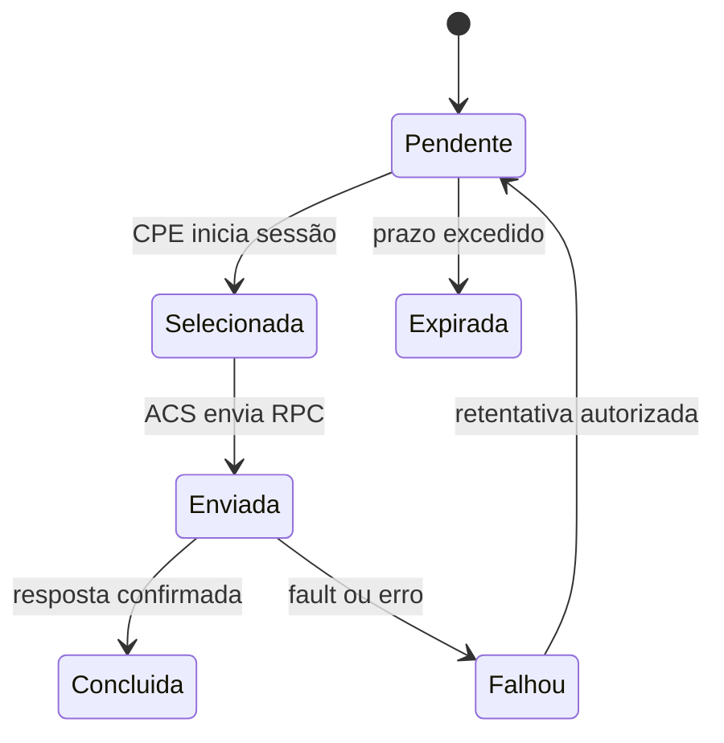
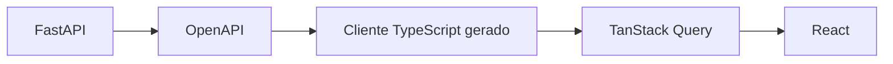

# Modelagem do Projeto ACS

## 1. Identificação

| Campo | Valor |
| --- | --- |
| Projeto | ACS para gerenciamento de CPEs Huawei |
| Documento | Modelagem técnica e definição inicial da stack |
| Versão | 0.1 |
| Estado | Em elaboração |
| Backend principal | Python com FastAPI |
| Frontend principal | React com TypeScript |
| Protocolo de gerenciamento | TR-069/CWMP |
| Estratégia inicial | Monólito modular com processos separados |

## 2. Objetivo

Este documento registra as decisões iniciais de arquitetura, stack de desenvolvimento, organização do repositório e práticas de engenharia para o desenvolvimento de um Auto-Configuration Server (ACS).

A solução deverá gerenciar CPEs Huawei, oferecendo inventário, consultas, diagnósticos, configurações remotas, operações de firmware, auditoria e integração com sistemas internos.

O desenvolvimento será realizado com participação ativa do Codex. Por isso, a modelagem prioriza tipagem forte, contratos explícitos, testes automatizados, documentação versionada e componentes que possam ser inspecionados e modificados dentro do próprio repositório.

Este documento complementa `documentacao_requisitos_funcionais_acs.md`.

## 3. Princípios arquiteturais

1. Começar com um monólito modular, evitando microsserviços prematuros.
2. Executar separadamente a API administrativa, o endpoint CWMP e os workers.
3. Manter as regras de negócio independentes do framework e do protocolo.
4. Utilizar o OpenAPI do FastAPI como fonte de verdade dos contratos frontend/backend.
5. Tratar operações remotas como assíncronas e rastreáveis.
6. Diferenciar estado atual, estado desejado e operação pendente.
7. Manter compatibilidade por fabricante, modelo e firmware.
8. Não armazenar credenciais ou dados sensíveis em logs.
9. Utilizar dependências com licenças previamente aprovadas.
10. Exigir testes e critérios de aceite para cada entrega.

## 4. Arquitetura geral



### 4.1 Frontend

Responsável por:

- autenticação e autorização da interface;
- inventário e pesquisa de CPEs;
- detalhes de conectividade;
- acompanhamento de operações;
- execução de diagnósticos autorizados;
- gerenciamento de usuários e configurações;
- visualização de logs, eventos, métricas e auditoria.

### 4.2 API administrativa

Responsável por:

- expor os recursos utilizados pelo frontend;
- validar entradas por meio do Pydantic;
- aplicar permissões e regras de negócio;
- registrar operações pendentes;
- disponibilizar inventário e históricos;
- gerenciar arquivos e perfis de configuração;
- fornecer endpoints para integrações internas.

### 4.3 Aplicação CWMP

Responsável por:

- receber e autenticar sessões TR-069;
- processar SOAP/XML;
- receber mensagens `Inform`;
- identificar e atualizar CPEs;
- controlar o estado da sessão CWMP;
- selecionar operações pendentes;
- enviar RPCs compatíveis com a CPE;
- processar respostas e faults;
- receber eventos como `TransferComplete`;
- registrar telemetria e eventos.

A aplicação CWMP poderá utilizar FastAPI/Starlette, mas deverá ser executada separadamente da API administrativa. Essa separação permite políticas de segurança, disponibilidade e escala diferentes.

### 4.4 Workers

Responsáveis por:

- retentativas e expiração de operações;
- processamento de históricos;
- cálculo de indicadores;
- geração de exportações;
- validação de arquivos e firmwares;
- agendamentos;
- retenção e limpeza de dados;
- notificações e rotinas operacionais.

## 5. Stack aprovada para o frontend

```text
React + TypeScript + Vite
React Router
ReUI Free Components
Radix UI
Tailwind CSS
TanStack Query
TanStack Table
TanStack Virtual
React Hook Form
Zod
Apache ECharts
Vitest
React Testing Library
Playwright
Storybook
```

### 5.1 React, TypeScript e Vite

- React será utilizado para construir a aplicação administrativa.
- TypeScript deverá operar em modo `strict`.
- Vite será utilizado para desenvolvimento e build.
- React Router será responsável pela navegação da SPA.
- Não será utilizado Next.js inicialmente, pois o ACS é uma aplicação interna e não depende de SEO ou renderização no servidor.

### 5.2 ReUI

A ReUI será utilizada como catálogo de componentes e exemplos para acelerar a criação da interface. Ela faz parte do ecossistema shadcn/ui e utiliza o CLI do shadcn para instalar componentes no código do projeto.

A ReUI não será tratada como uma dependência opaca nem como substituição de toda a fundação visual. Os componentes escolhidos deverão ser incorporados ao repositório, revisados, adaptados e testados.

#### Recursos gratuitos identificados

- Data Grid;
- filtros;
- formulários;
- upload de arquivos;
- dashboards;
- calendários;
- timeline;
- árvore;
- Kanban;
- Gantt;
- componentes de navegação e layout;
- exemplos de composição.

Referências:

- [Documentação da ReUI](https://reui.io/docs)
- [Componentes gratuitos](https://reui.io/components)
- [Integração da ReUI com Codex](https://reui.io/docs/codex)
- [Planos e separação entre recursos gratuitos e pagos](https://reui.io/pricing)

#### Política de utilização da ReUI

1. Utilizar somente componentes e exemplos gratuitos, salvo decisão formal posterior.
2. Não utilizar blocks, templates ou ícones pagos sem aprovação e registro da licença.
3. Não armazenar chaves ou tokens da ReUI no repositório.
4. Revisar o código e as dependências de cada componente antes da incorporação.
5. Versionar o componente dentro do repositório.
6. Não depender da ReUI durante build ou execução em produção.
7. Não atualizar automaticamente um componente que já tenha sido adaptado.
8. Registrar a origem e a versão do componente importado.
9. Manter as notificações de licença exigidas.
10. Padronizar Radix UI como base de primitives e evitar misturar Radix UI e Base UI sem justificativa arquitetural.

### 5.3 Organização dos componentes

```text
frontend/src/components/
├── ui/
│   ├── button.tsx
│   ├── dialog.tsx
│   ├── input.tsx
│   └── data-grid.tsx
└── acs/
    ├── cpe-table.tsx
    ├── device-status.tsx
    ├── optical-signal.tsx
    ├── diagnostic-panel.tsx
    └── operation-dialog.tsx
```

- `components/ui`: primitives e componentes derivados da ReUI.
- `components/acs`: componentes relacionados ao domínio do produto.
- `features`: casos de uso, hooks e regras de cada funcionalidade.
- `pages`: composição das páginas e rotas.
- `generated-api`: cliente produzido a partir do OpenAPI.

### 5.4 Tabelas

O Data Grid gratuito da ReUI poderá ser usado como ponto de partida visual. TanStack Table e TanStack Virtual serão responsáveis pelo comportamento e desempenho quando aplicável.

O componente interno `AcsDataGrid` deverá suportar:

- paginação no backend;
- ordenação no backend;
- filtros combinados;
- seleção de linhas;
- visibilidade de colunas;
- reorganização de colunas;
- redimensionamento;
- fixação de colunas;
- densidade de linhas;
- virtualização;
- persistência das preferências;
- exportação;
- operações em lote;
- estados de carregamento, vazio e erro.

### 5.5 Estado e comunicação

- TanStack Query deverá gerenciar os dados recebidos do backend.
- Respostas da API não deverão ser duplicadas desnecessariamente em um store global.
- Um store adicional somente deverá ser adotado quando existir estado local compartilhado que não pertença à API.
- O cliente TypeScript deverá ser gerado a partir do OpenAPI do FastAPI.

### 5.6 Formulários

- React Hook Form será responsável pelo estado dos formulários.
- Zod será responsável pela validação do frontend.
- Cada formulário deverá possuir schema explícito.
- Erros retornados pela API deverão ser convertidos para mensagens consistentes.

### 5.7 Gráficos

Apache ECharts será utilizado para:

- disponibilidade de CPEs;
- potência óptica;
- sessões CWMP;
- falhas e faults;
- resets;
- históricos de upload e download;
- distribuição por modelo e firmware.

## 6. Stack aprovada para o backend

```text
Python
FastAPI
Pydantic
SQLAlchemy
Alembic
PostgreSQL
RabbitMQ
Celery
Redis
MinIO / S3
Pytest
Ruff
Pyright
```

### 6.1 FastAPI e Pydantic

- FastAPI será utilizado na API administrativa e poderá servir de base para o endpoint CWMP.
- Pydantic deverá validar entradas, respostas e configurações.
- A especificação OpenAPI será a fonte de verdade para a integração com o frontend.
- Operações críticas ou demoradas não deverão depender somente de `BackgroundTasks`.

### 6.2 PostgreSQL

PostgreSQL será a fonte de verdade para:

- CPEs;
- modelos e firmwares;
- sessões CWMP;
- parâmetros relevantes;
- operações remotas;
- eventos;
- diagnósticos;
- usuários e permissões;
- arquivos;
- auditoria.

Será adotada uma estratégia híbrida para parâmetros TR-069:

- colunas relacionais para dados pesquisados frequentemente;
- JSONB para snapshots e parâmetros específicos de fabricante;
- tabelas históricas somente para valores que exigirem série temporal.

### 6.3 RabbitMQ, Celery e Redis

- RabbitMQ será o broker das tarefas duráveis.
- Celery executará trabalhos assíncronos e agendados.
- Redis será usado para cache, locks e estado temporário.
- PostgreSQL permanecerá como fonte de verdade das operações.

A fila não executa diretamente uma operação TR-069 em uma CPE offline. A operação permanece pendente até que uma sessão adequada seja iniciada ou uma Connection Request seja bem-sucedida.

### 6.4 Arquivos

MinIO ou outro armazenamento compatível com S3 será utilizado para:

- firmwares;
- arquivos de configuração;
- exportações;
- backups aplicáveis.

Os metadados, versões, checksums e compatibilidades permanecerão no PostgreSQL.

## 7. Ciclo de vida de uma operação remota



Cada operação deverá registrar:

- CPE de destino;
- usuário ou sistema solicitante;
- tipo da operação;
- parâmetros de entrada;
- data de criação;
- prazo de validade;
- tentativas;
- respostas e faults;
- estado final;
- dados de auditoria.

## 8. Integração frontend e backend



Regras:

1. Não criar manualmente no frontend tipos que já existam no contrato OpenAPI.
2. Gerar o cliente em pipeline controlado.
3. Verificar alterações geradas no controle de versão.
4. Fazer o pipeline falhar quando backend e frontend estiverem incompatíveis.
5. Não editar diretamente os arquivos da pasta `generated-api`.

## 9. Organização do repositório

```text
acs-platform/
├── AGENTS.md
├── README.md
├── compose.yaml
├── docs/
│   ├── REQUIREMENTS.md
│   ├── ARCHITECTURE.md
│   ├── SECURITY.md
│   └── adr/
├── frontend/
│   ├── AGENTS.md
│   ├── src/
│   │   ├── app/
│   │   ├── components/
│   │   ├── design-system/
│   │   ├── features/
│   │   ├── generated-api/
│   │   └── pages/
│   └── tests/
├── backend/
│   ├── AGENTS.md
│   ├── src/
│   │   ├── api/
│   │   ├── cwmp/
│   │   ├── domain/
│   │   ├── infrastructure/
│   │   └── workers/
│   ├── migrations/
│   └── tests/
└── deploy/
```

## 10. Desenvolvimento com Codex

### 10.1 Critérios de agentabilidade

O projeto deverá favorecer:

- módulos pequenos e coesos;
- nomes explícitos;
- tipagem forte;
- dependências injetadas;
- baixo acoplamento;
- contratos documentados;
- testes rápidos e determinísticos;
- comandos de execução simples;
- regras próximas do código ao qual se aplicam;
- ausência de configuração implícita desnecessária.

### 10.2 AGENTS.md

O `AGENTS.md` da raiz deverá registrar:

- mapa do repositório;
- comandos de instalação, execução, lint, tipagem e testes;
- convenções arquiteturais;
- política de dependências e licenças;
- regras de segurança;
- critérios de conclusão;
- procedimentos de revisão.

Arquivos adicionais poderão existir em `frontend/`, `backend/` e `backend/src/cwmp/` para regras específicas.

Referências oficiais do Codex:

- [Boas práticas](https://developers.openai.com/codex/learn/best-practices)
- [Instruções com AGENTS.md](https://developers.openai.com/codex/agent-configuration/agents-md)

### 10.3 Regras mínimas para o Codex

```markdown
- Não adicionar dependências de produção sem justificar.
- Não adicionar pacotes que exijam licença comercial.
- Manter TypeScript em modo strict.
- Não registrar senhas, tokens ou credenciais TR-069.
- Todo endpoint novo deve possuir testes.
- Toda mudança de banco deve possuir migration.
- Executar lint, typecheck e testes antes de concluir.
- Não editar manualmente o cliente OpenAPI gerado.
- Toda operação remota deve gerar registro de auditoria.
- Não executar operação destrutiva em CPE real fora do ambiente autorizado.
```

### 10.4 Forma recomendada das tarefas

Cada tarefa entregue ao Codex deverá conter:

1. objetivo;
2. contexto do negócio;
3. arquivos ou módulos relevantes;
4. critérios de aceite;
5. testes esperados;
6. restrições de segurança;
7. comandos de validação.

As entregas deverão ser pequenas e verticais. Um exemplo é: backend de consulta de CPE, cliente OpenAPI, tela de consulta e testes, em vez de solicitar todo o inventário de uma vez.

## 11. Testes e qualidade

### 11.1 Frontend

- Vitest para testes unitários;
- React Testing Library para componentes;
- Playwright para fluxos completos;
- Storybook para desenvolvimento e validação isolada dos componentes;
- ESLint e Prettier para padronização.

### 11.2 Backend

- Pytest para testes unitários e de integração;
- testes de banco com PostgreSQL;
- fixtures SOAP/XML por modelo Huawei;
- testes da máquina de estados CWMP;
- testes de faults, timeouts e retentativas;
- simulador de CPE;
- Ruff para lint e formatação;
- Pyright para tipagem.

### 11.3 Pipeline mínimo

```text
Frontend:
lint -> typecheck -> testes -> build

Backend:
lint -> typecheck -> testes -> validação das migrations

Integração:
gerar OpenAPI -> gerar cliente -> verificar incompatibilidades
```

## 12. Segurança

Os pontos de entrada deverão ser separados:

```text
cwmp.empresa.net     -> acessível pelas CPEs
api-acs.empresa.net  -> acesso administrativo controlado
acs.empresa.net      -> interface dos usuários
```

O endpoint CWMP deverá implementar:

- TLS;
- autenticação das CPEs;
- proteção contra XXE e XML malicioso;
- limite de tamanho do corpo;
- timeout de sessão;
- rate limiting;
- validação estrita dos RPCs;
- ocultação de credenciais nos logs;
- correlação de mensagens da sessão;
- auditoria das operações.

Operações como factory reset, alteração massiva e firmware deverão exigir permissões específicas e confirmações adicionais.

## 13. Política de dependências e licenças

1. Manter uma lista de licenças permitidas.
2. Avaliar dependências diretas e transitivas.
3. Versionar lockfiles.
4. Gerar inventário ou SBOM no pipeline.
5. Executar verificação automatizada de licenças.
6. Evitar recursos cuja função essencial dependa de plano comercial.
7. Registrar exceções por meio de Architecture Decision Record.
8. Preservar avisos de copyright e licença exigidos.
9. Fixar versões de produção e realizar atualizações controladas.
10. Revisar novamente a licença antes de atualizar uma versão principal.

## 14. Estratégia inicial de implantação

Para a base inicialmente observada, não será adotado Kubernetes como requisito do MVP.

O ambiente poderá iniciar com:

- frontend estático;
- duas ou mais instâncias da API administrativa;
- duas ou mais instâncias CWMP;
- um ou mais workers;
- PostgreSQL;
- RabbitMQ;
- Redis;
- MinIO;
- proxy reverso;
- métricas e logs centralizados.

A quantidade final de réplicas deverá ser determinada por testes de carga e métricas reais.

## 15. Decisões pendentes

- versão inicial de Python e política de atualização;
- gerenciador de dependências Python;
- gerenciador de pacotes Node;
- ferramenta específica para geração do cliente OpenAPI;
- solução de identidade, como Keycloak ou provedor corporativo existente;
- política de autenticação das CPEs;
- modelo de implantação em homologação e produção;
- requisitos de disponibilidade e recuperação;
- estratégia de observabilidade;
- retenção de sessões, parâmetros e eventos;
- compatibilidade por modelo e firmware Huawei.

## 16. Decisão registrada

A stack inicial aprovada para estudo e prova de conceito é:

```text
Frontend:
React + TypeScript + Vite
ReUI Free Components + Radix UI + Tailwind CSS
TanStack Query + TanStack Table + TanStack Virtual
React Hook Form + Zod
Apache ECharts

Backend:
Python + FastAPI + Pydantic
SQLAlchemy + Alembic
PostgreSQL
RabbitMQ + Celery
Redis
MinIO / S3

Qualidade:
Vitest + React Testing Library + Playwright + Storybook
Pytest + Ruff + Pyright
OpenAPI como contrato
AGENTS.md como orientação permanente para o Codex
```

A ReUI será utilizada como acelerador visual e fonte de componentes gratuitos. O código incorporado deverá ser mantido dentro do projeto, sem dependência operacional da plataforma e sem adoção automática de recursos comerciais.

## 17. Controle de versões

| Versão | Alteração |
| --- | --- |
| 0.1 | Criação da modelagem inicial, definição da stack, uso da ReUI e práticas para desenvolvimento com Codex |

